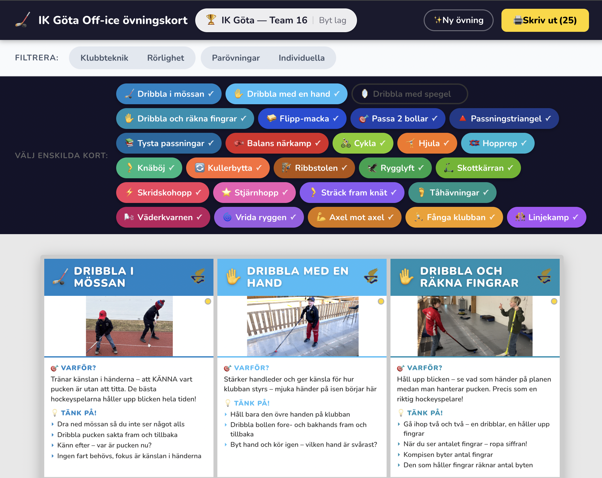

# Hockey Övningskort 🏒

En kortlek med övningar för hockey-träning utanför isen. Varje kort har bild, syfte och tips. Skriv ut sex kort per A4 (liggande) — eller bläddra i appen direkt på mobilen.

## 🌐 Använd appen

👉 **[https://gota-off-ice.wilhelmeklund.com](https://gota-off-ice.wilhelmeklund.com)**

Inloggning krävs. Hör av dig till Wille (se nedan) om du vill ha access till ditt lag.



## Vad du kan göra

- **Filtrera** övningarna på kategori — Klubbteknik / Rörlighet, Parövningar / Individuella.
- **Skriv ut** kort i A4 liggande, 6 stycken per sida.
- **Ladda upp egna foton** på era egna spelare när du valt ditt lag — roligare för barnen att se sina lagkamrater på korten. Bilderna lagras separat per lag.
- **Skapa nya övningar** via ✨ Ny övning-knappen.
- **Redigera övningstext** genom att öppna ett kort. Övningstexterna är gemensamma för alla lag — ändringar syns för alla.

## Hör av dig

För inloggning, frågor, feedback eller förslag på nya övningar:

- 📧 [wille.eklund@gmail.com](mailto:wille.eklund@gmail.com)
- 📱 [070-540 04 25](tel:+46705400425)

— Wille, lagledare i IK Göta Team 16

---

## För utvecklare

### Köra lokalt

```bash
npm install
npm run dev
```

Öppna `http://localhost:3000`. Övningar och bilder ligger i `public/content/` respektive `public/exercise_images/<lagmapp>/`. Ingen basic auth lokalt.

### Stack

- **Frontend:** React 18 + Vite + TypeScript
- **Backend:** Express (Node 24), kör i Azure Container Apps
- **Lagring:** Azure Blob Storage (bilder + övningstexter)
- **Auth:** HTTP Basic auth (cloud)
- **Telemetri:** Application Insights — sidvisningar + custom events (`TeamSelected`, `ImageUploaded`, `CardTextUpdated`, `ExerciseCreated`)
- **API-docs:** Swagger UI på `/swagger/`
- **OpenAPI-spec:** Genereras automatiskt från `@openapi`-JSDoc-block via `scripts/generate-openapi.mjs` vid varje `npm run build`

### Deploy & infrastruktur

Hela Azure-infran är beskriven i [`tofu/`](./tofu/) (OpenTofu / Terraform):

```bash
cd tofu
tofu apply -var-file=envs/prod.tfvars
```

För nya kod-deployer:

```bash
make manual-deploy
```

Mer detaljer i [`tofu/README.md`](./tofu/README.md).

### Synka content och bilder

Den deployade appen lagrar allt i Azure Blob Storage. För att hämta hem aktuell state lokalt (för att t.ex. commita uppladdade bilder eller nyskapade övningar):

```bash
make pull-content
```

Och för att pusha lokala filer upp till blob:

```bash
make push-content
```

Se Makefile för fler kommandon (`make help`).
